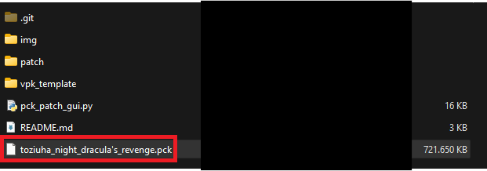
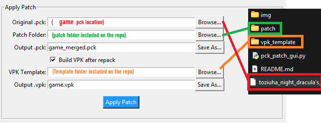
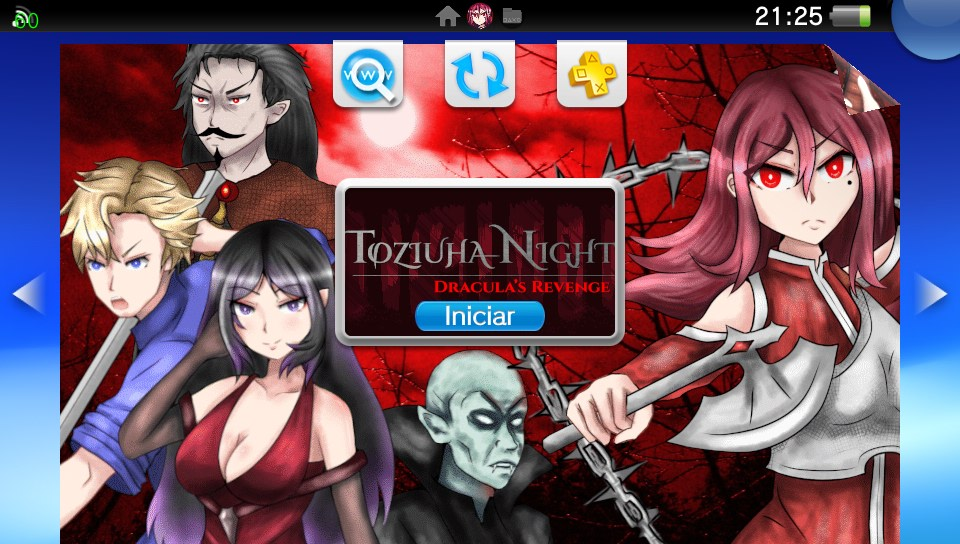
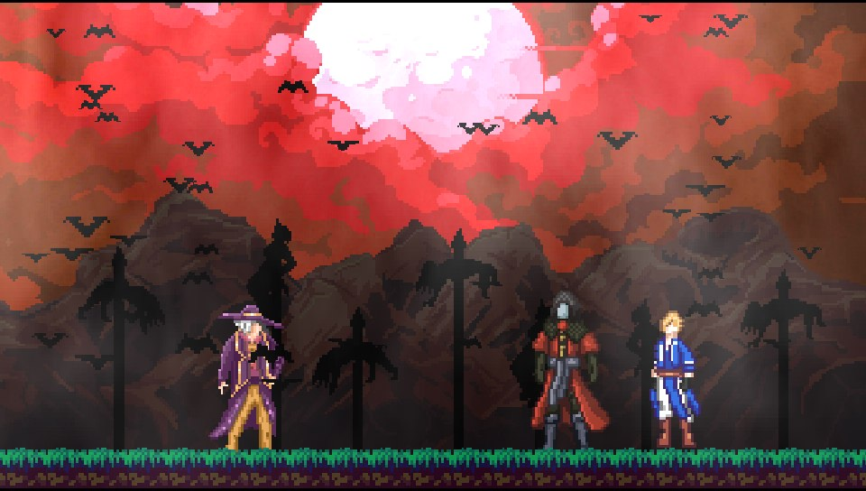
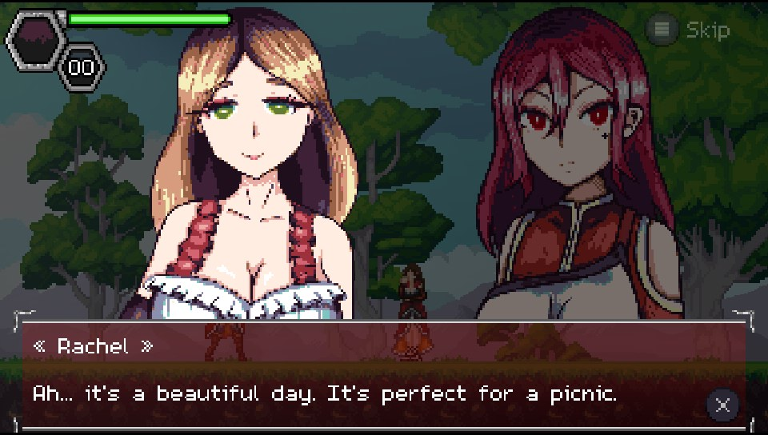
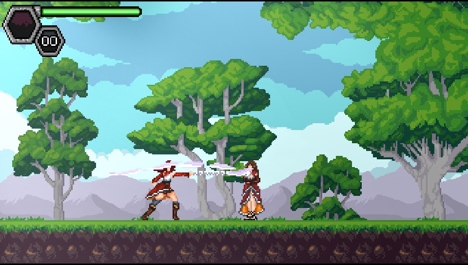
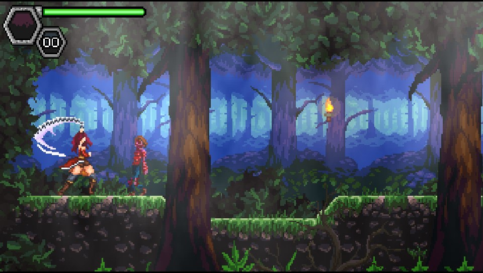
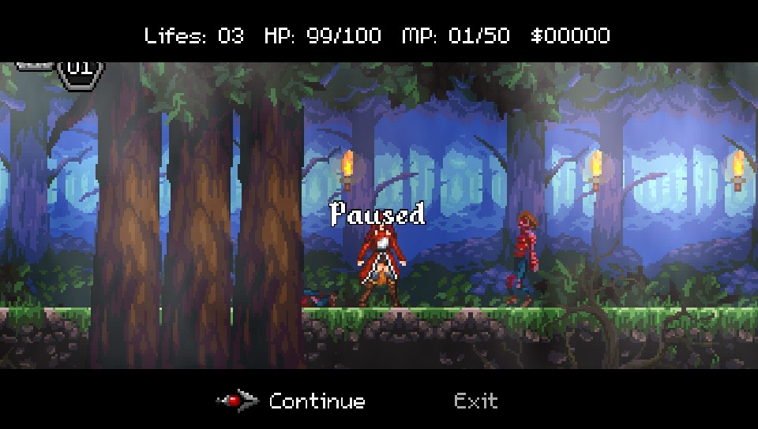

# Toziuha Night Dracula's Revenge — PSVita Patch

**A patch for _Toziuha Night Dracula's Revenge_ to run on the PlayStation Vita.**  
**Toziuha Night Dracula's Revenge** is a 2D side-scrolling action platformer with **classicvania style**. Travel through different linear maps set in a dark fantasy world; such as a gloomy forest and Count Dracula's castle.

Play as **Xandria**, a beautiful and skilled alchemist who, using an iron whip, fights against the most fearsome demons and other alchemists.

---

## 🌐 Official Game Download

- [Itch.io](https://dannygaray60.itch.io/toziuha-night-draculas-revenge)  
- [Steam](https://store.steampowered.com/app/1872040/Toziuha_Night_Draculas_Revenge/)

---

## 🎮 PSVita Patch Installation Guide

### 1. Download Required Files
- Get the game from [Itch.io](https://dannygaray60.itch.io/toziuha-night-draculas-revenge) or [Steam](https://store.steampowered.com/app/1872040/Toziuha_Night_Draculas_Revenge/).
- Clone or download this **PSVita patch repository**.

### 2. Prepare the Game Files
- Locate `toziuha_night_dracula's_revenge.pck` in the downloaded game folder.
- Place it inside the patch repository folder.



### 3. Run the Patch Script

Using **Python 3**, execute the following command or double click it to execute it:

```bash
python pck_patch_gui.py
```

Set up the following paths and press **Apply Patch**



Once completed, you'll see:


### 4. Install on Your PSVita

You now have two options:

- **Install via VPK:**  
  Use **VitaShell** to install the generated `game.vpk`.

- **Manual Install:**  
  - Download the game from **VitaDB**.  
  - Replace the `.pck` file in `ux0:data/game_data/` with your `game_merged.pck`, renamed to `game.pck`.



---

## Known issues:

- small sttuters whil loadign some assets.


---
## 📸 Screenshots

Explore Toziuha Night Dracula's Revenge created by Danny Garay:

 
 
  


